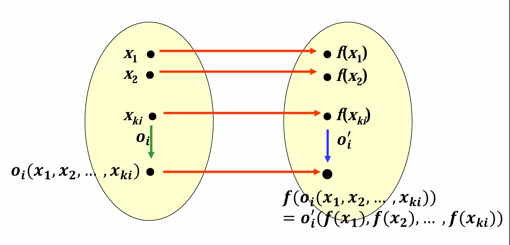

## 代数系统、子系统和积代数
- **代数系统**$V=\langle A, \Omega, K\rangle$
  - $A$：非空对象集合（载体），$\Omega$：非空运算集合，$K$：代数常数集合
  - 代数常数可以看作一种0元运算
  - $\langle \mathbb{N}, +, 0\rangle,\langle \mathbb{N}, +\rangle, \langle \mathbb{N}\rangle$
- **字代数**$\langle \Sigma^{*},\circ, ', \land\rangle$
  - $\Sigma^{*}$：有穷字母表$\Sigma$上所有串的集合
  - $\circ$：二元连接运算，$'$：一元求逆运算，$\land$：空串
- **语言代数**$\langle P(\Sigma^{*}), \cup, \cap, \cdot, \vartriangle\rangle$
  - $P(\Sigma^{*})$：所有语言的集合（语言：所有串集合$\Sigma^{*}$的子集）
  - $\cdot$：两个语言的连接，没有交换律，$L_1 \cdot L_2 = \lbrace w_1 \circ w_2 \vert w_1 \in L_1, w_2 \in L_2\rbrace$
  - $\vartriangle$：语言的逆运算，$\vartriangle L=\lbrace w' \vert w \in L\rbrace$
- **同类型**的代数系统：运算数量相同，且对应运算具有相同的**元数**
- **同种**的代数系统：对应运算具有共同的**运算性质**
- **子代数**：对象集合为原代数系统的子集，对原代数系统中的所有运算**封闭**
  - 真子代数：真子集
  - 平凡子代数：对象集合所有代数常数的集合，和原代数系统自身
  - 把代数常数看作一种0元运算，对该运算封闭等价于**包含代数常数**
- **积代数**$V_1 \times V_2=\langle A\times B, o_1, o_2,...,o_r\rangle$
  - 对于**同类型**代数系统$V_1, V_2$，对象集合为二者对象集合的笛卡尔积
  - 运算为原本二者的对应运算分别作用，得到的结果的笛卡尔积
  - 与因子代数系统**同类型**
  - 保留**交换律、结合律、分配律、吸收律**
  - 因子代数系统中的**单位元/零元/幂等元/可逆元素及其逆元**的笛卡尔积是积代数的单位元/零元/幂等元/可逆元素及其逆元
  - **不保留消去律**
    - 若因子代数系统不含有消去律，则积代数与其**同种**，否则不保证
    - 本质是因为积代数的零元为$\langle \theta_1,\theta_2\rangle$
    - 而$\forall \lambda_1,\lambda_2,\langle \theta_1, \lambda_1\rangle \cdot \langle \lambda_2, \theta_2\rangle = \langle \theta_1, \theta_2\rangle$
    - 显然左边不能消去
  - 推广到有限$n$元积代数上述性质依旧成立
  - **直积分解是研究代数结构的有效手段**
  - **笛卡儿积是构造同种离散结构的有效手段**
- **同态（同态映射）**
  - 以二元运算为例：$V_1=\langle A, \circ\rangle,V_2=\langle B,*\rangle$是**同类型**的代数系统，$\phi:A\rightarrow B,\forall x,y\in A,\phi(x\circ y)=\phi(x) * \phi(y)$，$\phi$为**同态映射**
  - 对于**所有运算**（包括0元运算），对一个代数系统的运算结果的同态映射结果等于对另一个代数系统的运算对象的同态映射结果的运算结果（**先运算再映射=先映射再运算**）
  - $\langle \mathbb{Z}, +\rangle, \langle \mathbb{Z}_n, \oplus\rangle,\phi(x)=x\mod n$
  - 按映射分类：满同态$\sim$、单同态、同构（双射）$\cong$、零同态（$\phi=0$）
  - 按载体分类：自同态
  - 例如：$\langle \Sigma^{*},\circ, \land\rangle, \langle \mathbb{Z}, +, 0\rangle, \phi(w)=\vert w\vert, \forall w \in \Sigma^{*}$为满同态，字母表只有一个字母时为同构
  - $\langle \mathbb{Z}_n, \oplus\rangle$恰好存在$n$个自同态$\phi(x)=px \mod n, p = 0,1,...,n-1$（$p$取$n$和$0$时$\phi$相同）
  - **同态像**：在$V_1,V_2$同态的基础上，$\phi(A)$关于$B$中的所有运算构成代数系统（封闭），是$V_2$的子代数，称为$V_1$在$\phi$下的同态像

- **置换性质**：一个**等价关系**，在运算前后保持等价性，则该等价关系对于该运算具有置换性质
$$a_j \sim b_j \Rightarrow o_i(a_1,...,a_{k_i})\sim o_i(b_1,...,b_{k_i})$$
- **同余关系**：对于一个代数系统中的所有运算都具有**置换性质**的**等价关系**
  - 判断同余关系一定要先判断是否为等价关系，再验证是否对运算保持等价性
- **商代数**$V/\sim = \langle A/\sim , \bar{o_1},\bar{o_2},...,\bar{o_r}\rangle$
  $$\bar{o_i}([a_1],[a_2],...,[a_{k_i}])=[o_i(a_1,a_2,...,a_{k_i})]$$
  - 等价类的运算结果等于运算结果的等价类
  - 与原代数系统是同类型的
  - 保留**交换律、结合律、分配律、吸收律**
  - 保留**单位元/零元/幂等元/可逆元素及其逆元**，逆元的等价类=等价类的逆元
  - **不保留消去律**，因为等价关系不是一一对应的
    - $[0]\otimes_4 [2] = [2]\otimes_4 [2]$，等价关系使得$[0]=[4]$
- **同态映射导出同余关系**
  - $\phi:A\rightarrow B$是$V_1$到$V_2$的同态映射，由此导出的$A$上的等价关系$\sim$是$V_1$上的同余关系
  - 即$\phi(a_i)=\phi(b_i)\Leftrightarrow a_i \sim b_i$且$\phi(o_i(a_1,...,a_{k_i}))=o_i(\phi(a_1),...,\phi(a_{k_i}))$，则$o_i(a_1,...,a_{k_i})\sim o_i(b_1,...,b_{k_i})$
  - 同态：先运算再映射=先映射再运算
  - 同余关系（置换性质）：先等价再运算=先运算再等价
  - 同态导出的等价关系：先映射再运算的结果相等$\Rightarrow$先运算再映射的结果相等$\Rightarrow$先运算再等价
  - 每个同态都可以导出一个同余关系，但不是所有同余关系都可以由同态导出
- **商代数是原代数的同态像**
  - 由同余关系$\sim$决定的**自然映射**$g:A\rightarrow A/\sim,g(a)=[a],\forall a \in A$是从$V$到$V/\sim$的同态映射
  - 基于一个同余关系的自然映射把原代数系统映射到商代数
- **同态基本定理**：代数系统在给定同态映射下的**同态像**，**同构**于该同态导出的同余关系下的**商代数**
  - $\phi:A\rightarrow B$是$V_1$到$V_2$的同态
  - $\sim$是$\phi$导出的$V_1$上的同余关系
  - 则$V_1/\sim \cong \langle \phi(A), o'_1,...,o'_r\rangle$
  - 证明：构造同态双射$h:A/\sim \rightarrow \phi(A), h([a])=\phi(a),\forall [a]\in A/\sim$
  - 在自然映射下商代数就是原代数的同态像
  - 任何代数系统的**商代数**与**同态像**在同构意义下相等

## Appendix
- [习题解析](https://www.doc88.com/p-1498083213133.html?r=1)Page107